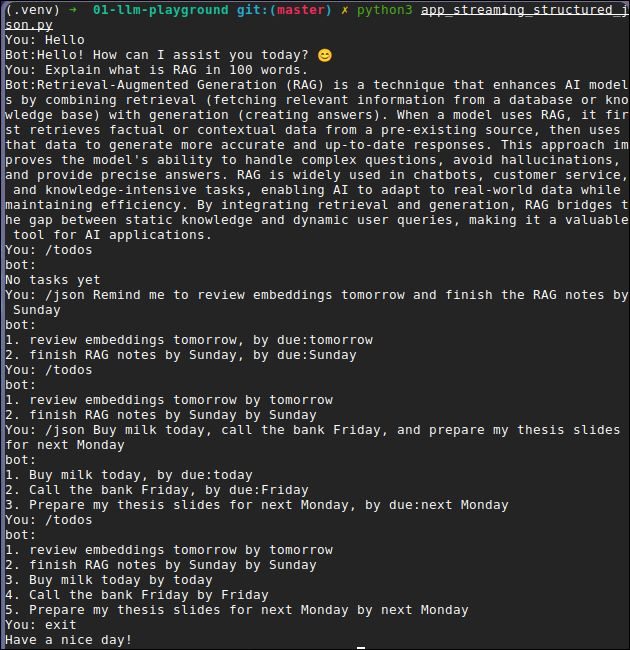

# LLM Playground 🤖

[](https://www.python.org/)
[](https://ollama.com)
[](LICENSE)

A CLI chatbot running on a **local LLM** (Ollama) — streaming replies, structured task extraction, and an in-session todo list. Phase 1 of my AI Engineering learning path. No API key, no cloud, no cost.



## Features

- 💬 Streaming chat with conversation history (stateless model + resent history = memory)
- 🧾 `/json <text>` — free text in, validated JSON out (task extraction with `format="json"`)
- ✅ `/todos` — in-session todo list built from extractions
- 🛡️ Defensive parsing: every model output is validated before use

## Quickstart (under 5 min)

```bash
python3 -m venv .venv && source .venv/bin/activate
pip install -r requirements.txt
```

Pull (or import) a model and serve it:

```bash
ollama pull qwen3-1.7b   # or import a local .gguf, see below
```

### Import a local `.gguf` via Modelfile (zero download)

If you already have GGUF weights on disk (e.g. LMStudio downloads in `~/.lmstudio/models`), point Ollama at the file instead of pulling:

```bash
# Modelfile — absolute path to YOUR .gguf file:
printf 'FROM /home/luv-surve/.lmstudio/models/MaziyarPanahi/Qwen3-1.7B-GGUF/Qwen3-1.7B.Q6_K.gguf\n' > Modelfile
ollama create qwen3-1.7b -f Modelfile
ollama run qwen3-1.7b
```

Find your files with `find ~/.lmstudio/models -name "*.gguf"`. Note: only `.gguf` works this way — safetensors checkpoints can't be imported (pull the quantized equivalent instead), and draft models (e.g. `*-MTP-*.gguf`, used for speculative decoding) are not standalone chat models.

Then run — the model name in the code must match `ollama list` exactly:

```bash
python app_streaming_structured_json.py
```

| Script | What it is |
|---|---|
| `app.py` | Blocking chat loop (simplest version) |
| `app_streaming.py` | Token-streaming chat |
| `app_streaming_structured_json.py` | Full version: streaming chat + `/json` + `/todos` ⭐ |

Commands: `/json <text>` extract tasks · `/todos` list tasks · `exit`/`quit` quit.

## Architecture

```
you ──▶ CLI loop ──┬──▶ ollama.chat(stream=True) ──▶ tokens ──▶ you
                   │
                   └──▶ ollama.chat(format="json") ──▶ validate ──▶ todos ──▶ you
                              (extraction branch, skips history)
```

## Next tasks

- [ ] Write forced-JSON reliability notes (schema-strict vs loose prompt)
- [ ] Add latency impression, local vs cloud
- [x] Add demo screenshot/GIF above

## Docs in this repo

- `LEARNINGS.md` — concepts + reusable patterns (streaming loop, extraction call, defensive parse, command branch)
- `ERRORS_AND_BUGS.md` — all 13 errors hit during the build, cause + fix each

## Tech

Python · [Ollama](https://ollama.com) (`ollama` package) · Qwen3-1.7B (local `.gguf`, imported from LMStudio downloads)

## Resources

- [Ollama + Python chatbot tutorial](https://www.youtube.com/watch?v=rh7JJEfdwVk) — starting point for `app.py`
